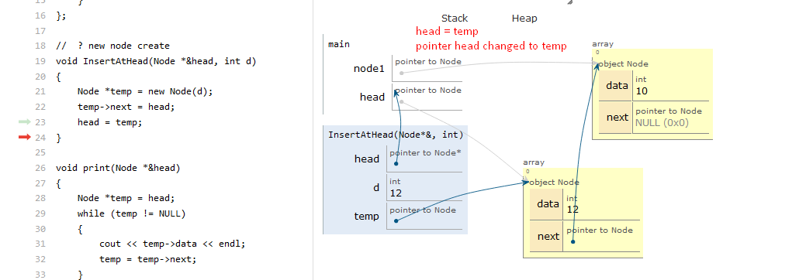
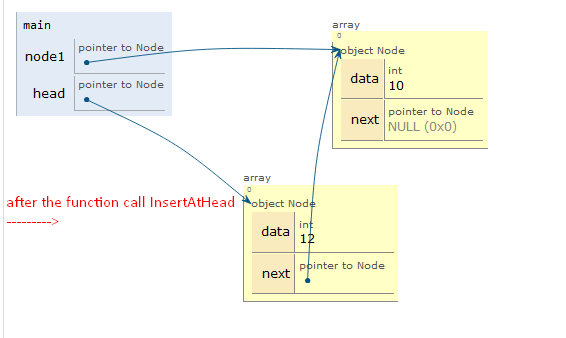

## CODE
```cpp
#include <iostream>
using namespace std;

// Node class represents a node in the linked list
class Node
{
public:
    int data; // data stored in the node
    Node *next; // pointer to the next node in the list

    // constructor to initialize the data and next pointer of the node
    Node(int data)
    {
        this->data = data;
        this->next = NULL;
    }
};

// InsertAtHead function inserts a new node at the beginning of the list
void InsertAtHead(Node *&head, int d)
{
    // create a new node with the given value
    Node *temp = new Node(d);

    // set the next pointer of the new node to point to the current head
    temp->next = head;

    // update the head pointer to point to the new node
    head = temp;
}

// print function prints the values of all the nodes in the list
void print(Node *&head)
{
    // create a temporary pointer and initialize it to point to the head of the list
    Node *temp = head;

    // iterate through the list using a while loop
    while (temp != NULL)
    {
        // print the value of the current node
        cout << temp->data << endl;

        // update the temporary pointer to point to the next node in the list
        temp = temp->next;
    }

    // print a newline character to separate the output from other text
    cout << endl;
}

int main()
{
    // create a new node with a value of 10 and assign it to the node1 pointer
    Node *node1 = new Node(10);

    // set the head pointer to point to node1
    Node *head = node1;

    // insert a new node with a value of 12 at the beginning of the list
    InsertAtHead(head, 12);

    // print the values of all the nodes in the list
    print(head);

    return 0;
}
```
## EXPLAINATION
* We define a class Node which represents a node in the linked list. It has two data members - data which stores the value of the node and next which is a pointer to the next node in the list.
* We define a function InsertAtHead which takes a reference to the head pointer and the value to be inserted as arguments.
* Inside the InsertAtHead function, we create a new node with the given value using the new operator. 
* We set the next pointer of the new node to point to the current head of the list.
* We update the head pointer to point to the new node, so that the new node becomes the first node in the list.
* We define a function print which takes a reference to the head pointer and prints the values of all the nodes in the list.
* Inside the print function, we create a temporary pointer temp and initialize it to point to the head of the list.
* We iterate through the list using a while loop, printing the value of each node and updating the temp pointer to point to the next node in the list.
* In the main function, we create a new node with a value of 10 and assign it to the node1 pointer.
* We set the head pointer to point to node1 .
* We call the InsertAtHead function to insert a new node with a value of 12 at the beginning of the list.
* Finally, we call the print function to print the values of all the nodes in the list.

## PERSONAL DOUBTS
#### why are we doing head = temp;


* In the  InsertAtHead  function, we are setting the  head  pointer to point to the new node that we have just inserted at the beginning of the list. 
* This is because the head pointer is the starting point of the linked list and it needs to be updated to point to the new node so that the new node becomes the first node in the list.
* If we don't update the head pointer, then the new node will be inserted at the beginning of the list but the head pointer will still be pointing to the old first node, which is no longer the first node after the insertion.