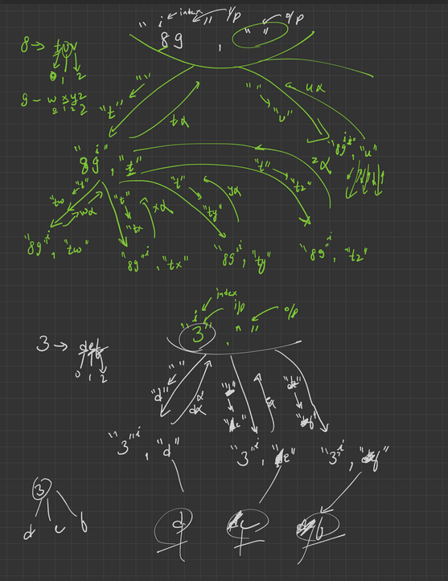

## DRY RUN/APPROACH

## CODE
```cpp
#include <iostream>
#include <string>
#include <vector>
using namespace std;

void combination(string &digits, vector<string> &ans, string subset, int index, vector<string> mapping)
{
    if (index >= digits.length())
    {
        ans.push_back(subset);
        return;
    }
    int number = digits[index] - '0';
    string value = mapping[number];
    for (int i = 0; i < value.size(); i++)
    {
        subset.push_back(value[i]);
        combination(digits, ans, subset, index + 1, mapping);
        subset.pop_back();
    }
}
int main()
{
    string digits = "23";
    vector<string> ans;
    string subset = "";
    int index = 0;
    vector<string> mapping = {"", "", "abc", "def", "ghi", "jkl", "mno", "pqrs", "tuv", "wxyz"};
    combination(digits, ans, subset, index, mapping);
    for (int element = 0; element < ans.size(); element++)
    {
        cout << ans[element] << " ";
    }
    return 0;
}
```
## EXPLAINATION
* The main function initializes a string "digits" that contains a series of digits (in this case, "23").

* The code then initializes an empty vector "ans" to hold all possible combinations of letters generated from the digits in the input string.

* The function then initializes an empty string "subset", which is used to hold each combination of letters that is generated.

* The code also initializes an integer variable "index" to zero. The index variable is used to keep track of the current position in the "digits" string.

* The code then initializes a vector "mapping" that holds a mapping of each digit to its possible corresponding letters. For example, the digit "2" maps to "abc", the digit "3" maps to "def", and so on.

* The combination function takes the input string, "digits", and a reference to the "ans" vector as arguments, along with the "subset" string, the "index" integer, and the "mapping" vector.

* The function starts by checking if the index is greater than or equal to the length of the input string "digits". If it is, then it has generated a complete combination of letters and it adds that combination to the "ans" vector using the push_back function.

* If the index is less than the length of the input string "digits", then the function uses the index to retrieve the corresponding digit from the "digits" string. It then uses the digit to retrieve the corresponding letters from the "mapping" vector.

* The function then loops through each letter in the set of possible letters and generates a new combination of letters by appending the current letter to the "subset" string. It then calls itself recursively, passing in the updated "subset" string, the "index+1", and the "mapping" vector.

* After the recursive call completes, the function removes the last character from the "subset" string using the pop_back function,