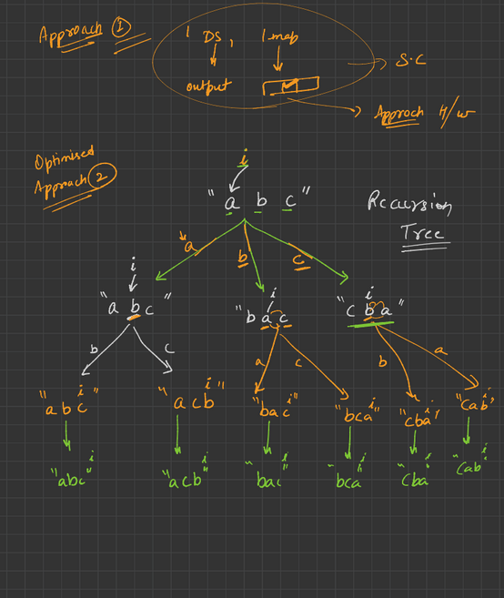

## DRY RUN/APPROACH


## CODE
```cpp
#include <iostream>
#include <vector>
using namespace std;

void solve(vector<int> nums, vector<vector<int>> &ans, int index)
{
    if (index >= nums.size())
    {
        ans.push_back(nums);
        return;
    }
    for (int j = index; j < nums.size(); j++)
    {
        swap(nums[index], nums[j]);
        solve(nums, ans, index + 1);
        swap(nums[index], nums[j]);
    }
}

int main()
{
    vector<int> nums = {1, 2, 3};
    vector<vector<int>> ans;
    int index = 0;
    solve(nums, ans, index);
    return 0;
}
```
## EXPLAINATION
The code generates all permutations of a given vector of integers. It uses a recursive function called solve to generate the permutations, and stores them in a vector of vectors called ans.

Here is a step-by-step explanation of how the code works:

* The main function initializes the input vector nums to {1, 2, 3}, and initializes an empty vector of vectors called ans.
* The main function calls the solve function with the input vector nums, the output vector ans, and an initial index of 0.
* The solve function takes three arguments: a vector of integers called nums, a vector of vectors of integers called ans, and an integer called index.
* The solve function first checks whether index is greater than or equal to the size of nums. If it is, that means we have reached the end of the vector, and we have generated a new permutation. In this case, we push the current nums vector into the ans vector of vectors.
* If we have not yet reached the end of the vector, we loop through all the remaining elements of the vector, starting at index j = index. For each element nums[j], we swap it with the element at index index.
* After swapping the elements, we recursively call the solve function with the updated nums vector, the ans vector, and an index that is one larger than the current index (index+1).
* After the recursive call to solve returns, we swap the elements back to their original positions. This is necessary to ensure that we generate all possible permutations.
* Once all recursive calls have returned, the ans vector will contain all the permutations of the original nums vector.
* Finally, the main function returns 0 to indicate successful completion of the program.