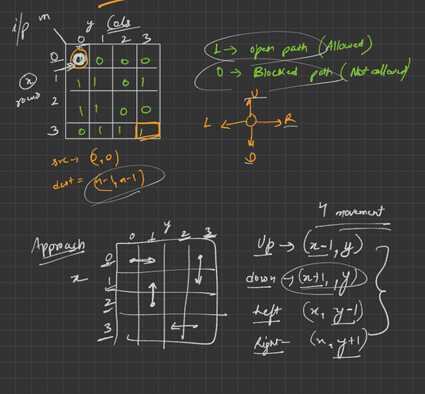
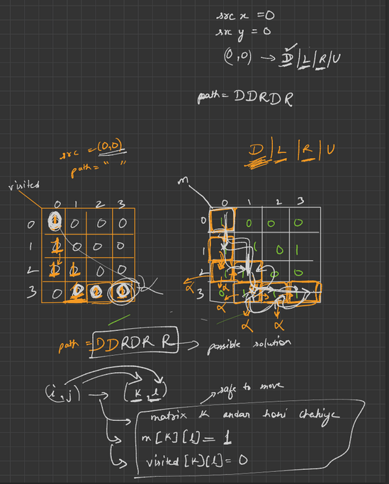

## DRY RUN/APPROACH


## CODE
```cpp
#include <iostream>
#include <vector>
using namespace std;

bool checkPath(int newx, int newy, int n, vector<vector<int>> visited, vector<vector<int>> &m)
{
    if ((newx >= 0 && newx < n) && (newy >= 0 && newy < n) && visited[newx][newy] == 0 && m[newx][newy] == 1)
    {
        return true;
    }
    return false;
}

void MazeSolve(vector<vector<int>> visited, vector<vector<int>> &m, int x, int y, vector<string> &ans, string path, int n)
{
    if (x == n - 1 && y == n - 1)
    {
        ans.push_back(path);
        return;
    }
    visited[x][y] = 1;
    // * DOWN

    int newx = x + 1;
    int newy = y;
    if (checkPath(newx, newy, n, visited, m))
    {
        path.push_back('D');
        MazeSolve(visited, m, newx, newy, ans, path, 4);
        path.pop_back();
    }
    // * LEFT
    newx = x;
    newy = y - 1;
    if (checkPath(newx, newy, n, visited, m))
    {
        path.push_back('L');
        MazeSolve(visited, m, newx, newy, ans, path, 4);
        path.pop_back();
    }
    // * UP
    newx = x - 1;
    newy = y;
    if (checkPath(newx, newy, n, visited, m))
    {
        path.push_back('U');
        MazeSolve(visited, m, newx, newy, ans, path, 4);
        path.pop_back();
    }
    // * RIGHT
    newx = x;
    newy = y + 1;
    if (checkPath(newx, newy, n, visited, m))
    {
        path.push_back('R');
        MazeSolve(visited, m, newx, newy, ans, path, 4);
        path.pop_back();
    }
}

int main()
{
    vector<vector<int>> m = {{1, 0, 0, 0}, {1, 1, 0, 1}, {1, 1, 0, 0}, {0, 1, 1, 1}};

    vector<vector<int>> visited = m;
    for (int i = 0; i < 4; i++)
    {
        for (int j = 0; j < 4; j++)
        {
            visited[i][j] = 0;
        }
    }
    int x = 0;
    int y = 0;
    vector<string> ans;
    string path = "";
    MazeSolve(visited, m, x, y, ans, path, 4);
    for (int i = 0; i < ans.size(); i++)
    {
        cout << ans[i] << " ";
    }

    return 0;
}
```
## EXPLAINATION
* The code starts with including the necessary header files - iostream and vector.

* A function named 'checkPath' is defined which takes four arguments: newx, newy, n, visited, and m. Here, newx and newy are the coordinates of the next cell that the algorithm wants to move to, n is the size of the maze, visited is a 2D vector to keep track of the visited cells, and m is the 2D vector representing the maze itself. The function checks if the next cell (newx, newy) is within the maze bounds, unvisited and is a valid path (i.e., it has a value of 1). If all conditions are satisfied, it returns true; otherwise, it returns false.

* The 'MazeSolve' function is defined which takes seven arguments: visited, m, x, y, ans, path, and n. Here, visited is a 2D vector to keep track of the visited cells, m is the 2D vector representing the maze itself, x and y are the current coordinates of the cell, ans is a vector of strings to store all possible paths, path is a string that keeps track of the current path, and n is the size of the maze.

* The function checks if the current cell is the bottom-right cell of the maze. If it is, then it means that we have found a valid path from the top-left corner to the bottom-right corner of the maze. So, we add the current path to the 'ans' vector and return.

* We mark the current cell as visited by setting the corresponding value in the 'visited' 2D vector to 1.

* The function then tries to explore all possible paths from the current cell. It first checks the path towards the down direction. If it is a valid path (i.e., satisfies the conditions in the 'checkPath' function), then we append the letter 'D' to the current path and recursively call the 'MazeSolve' function with the new coordinates, updated path, and 'ans' vector. After that, we remove the last character from the path to backtrack and try other possible paths.

* Similarly, we check paths towards the left, up, and right directions by updating the corresponding newx and newy variables and checking them using the 'checkPath' function. If the path is valid, we append the corresponding letter to the path, recursively call the 'MazeSolve' function, and remove the last character from the path after the recursive call.

* The main function initializes the maze, visited 2D vector, starting coordinates (0, 0), empty vector of strings 'ans', and empty string 'path'.

* The 'MazeSolve' function is called with the initialized parameters.

* Finally, all possible paths are printed from the 'ans' vector.
