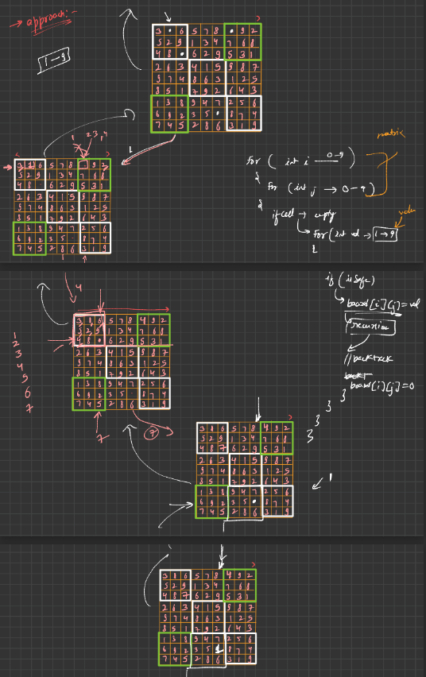

## APPROACH

## CODE
```cpp
#include <iostream>
#include <vector>
using namespace std;
bool isSafe(int row, int col, char val, vector<vector<char>> &sudoku, int n)
{
    for (int i = 0; i < n; i++)
    {
        if (sudoku[row][i] == val)
        {
            return false;
        }
        if (sudoku[i][col] == val)
        {
            return false;
        }
        if (sudoku[3 * (row / 3) + i / 3][3 * (col / 3) + i % 3] == val)
        {
            return false;
        }
    }
    return true;
}

bool solve(vector<vector<char>> &board)
{
    int n = board[0].size();
    for (int row = 0; row < n; row++)
    {
        for (int col = 0; col < n; col++)
        {
            if (board[row][col] == '.')
            {
                for (char val = '1'; val <= '9'; val++)
                {
                    if (isSafe(row, col, val, board, n))
                    {
                        board[row][col] = val;

                        bool if_possible = solve(board);
                        if (if_possible)
                        {
                            return true;
                        }
                        else
                        {
                            board[row][col] = '.';
                        }
                    }
                }
                return false;
            }
        }
    }
    return true;
}
int main()
{
    vector<vector<char>> board = {
        {'5', '3', '.', '.', '7', '.', '.', '.', '.'},
        {'6', '.', '.', '1', '9', '5', '.', '.', '.'},
        {'.', '9', '8', '.', '.', '.', '.', '6', '.'},
        {'8', '.', '.', '.', '6', '.', '.', '.', '3'},
        {'4', '.', '.', '8', '.', '3', '.', '.', '1'},
        {'7', '.', '.', '.', '2', '.', '.', '.', '6'},
        {'.', '6', '.', '.', '.', '.', '2', '8', '.'},
        {'.', '.', '.', '4', '1', '9', '.', '.', '5'},
        {'.', '.', '.', '.', '8', '.', '.', '7', '9'}};
    solve(board);
    for (int row = 0; row < 9; row++)
    {
        for (int col = 0; col < 9; col++)
        {
            cout << board[row][col] << " ";
        }
        cout << endl;
    }
}

```
## EXPLAINATION
The code includes two functions: isSafe() and solve(), and a main function.
```cpp
bool isSafe(int row, int col, char val, vector<vector<char>> &sudoku, int n)
{
    for (int i = 0; i < n; i++)
    {
        if (sudoku[row][i] == val)
        {
            return false;
        }
        if (sudoku[i][col] == val)
        {
            return false;
        }
        if (sudoku[3 * (row / 3) + i / 3][3 * (col / 3) + i % 3] == val)
        {
            return false;
        }
    }
    return true;
}
```
* The isSafe() function checks whether a particular value can be placed in the specified cell of the sudoku board or not, without violating the rules of the game. It takes the row, column, value to be placed, the sudoku board, and the size of the board as inputs.

* The function first checks if the value is already present in the same row or not. If it is present, it means that the value cannot be placed in the current cell and thus, it returns false.

* The function then checks if the value is already present in the same column or not. If it is present, it means that the value cannot be placed in the current cell and thus, it returns false.

* The function then checks if the value is already present in the same 3x3 sub-grid or not. To check this, it uses a formula that maps the cell's (row, col) position to its corresponding 3x3 sub-grid. If the value is already present in the same sub-grid, it means that the value cannot be placed in the current cell and thus, it returns false.

* If the value is not present in the same row, column, or sub-grid, it means that the value can be safely placed in the current cell, and thus, the function returns true.
```cpp
bool solve(vector<vector<char>> &board)
{
    int n = board[0].size();
    for (int row = 0; row < n; row++)
    {
        for (int col = 0; col < n; col++)
        {
            if (board[row][col] == '.')
            {
                for (char val = '1'; val <= '9'; val++)
                {
                    if (isSafe(row, col, val, board, n))
                    {
                        board[row][col] = val;

                        bool if_possible = solve(board);
                        if (if_possible)
                        {
                            return true;
                        }
                        else
                        {
                            board[row][col] = '.';
                        }
                    }
                }
                return false;
            }
        }
    }
    return true;
}
```
* The solve() function is the main function that solves the sudoku puzzle. It takes the sudoku board as input and returns true if the puzzle is solvable, and false otherwise.
* The function first gets the size of the board (i.e., the number of rows or columns). In this case, the size is 9x9.
* The function then loops through each cell of the board using two nested loops, starting from the top-left corner and moving towards the bottom-right corner.
* If a cell is empty (i.e., contains a '.'), the function tries to fill the cell with all possible values from '1' to '9'. It does this by using a for loop that iterates from '1' to '9'.
* For each value, the function first checks if it is safe to place the value in the current cell using the isSafe() function. If it is safe, the function places the value in the current cell and recursively calls itself to solve the next empty cell.
* If the next empty cell cannot be filled, the function backtracks by removing the previously placed value from the current cell and tries the next possible value for the current cell.
* If none of the values from '1' to '9' can be placed in the current cell, it means that the current configuration of the board is not solvable and thus, the function returns false.
* If all the cells of the board have been filled without any conflicts, it means that the sudoku puzzle has been solved and thus, the function returns true.

