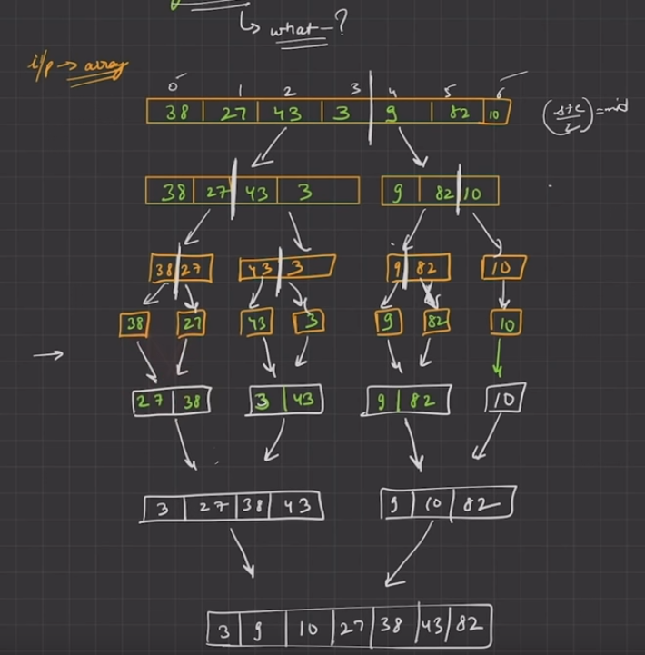

## APPROACH

## CODE
```cpp
#include <iostream>
using namespace std;

void merge(int *arr, int start, int end)
{
    int mid = (start + end) / 2;
    int length1 = mid - start + 1;
    int length2 = end - mid;

    int *First = new int[length1];
    int *Second = new int[length2];

    int MainArrayIndex = start;
    for (int i = 0; i < length1; i++)
    {
        First[i] = arr[MainArrayIndex++];
    }

    MainArrayIndex = mid + 1;

    for (int i = 0; i < length2; i++)
    {
        Second[i] = arr[MainArrayIndex++];
    }

    // Merge 2 sorted arrays

    int index1 = 0;
    int index2 = 0;
    MainArrayIndex = start;

    while (index1 < length1 && index2 < length2)
    {
        if (First[index1] >= Second[index2])
        {
            arr[MainArrayIndex++] = Second[index2++];
        }
        else
        {
            arr[MainArrayIndex++] = First[index1++];
        }
    }
    while (index1 < length1)
    {
        arr[MainArrayIndex++] = First[index1++];
    }
    while (index2 < length2)
    {
        arr[MainArrayIndex++] = Second[index2++];
    }
}

void mergeSort(int arr[], int start, int end)
{
    if (start < end)
    {
        int mid = (start + end) / 2;
        mergeSort(arr, start, mid);
        mergeSort(arr, mid + 1, end);
        merge(arr, start, end);
    }
}
int main()
{
    int arr[] = {4, 1, 6, 8, 12, 9, 0, 32};
    int start = 0;
    int end = sizeof(arr) / sizeof(arr[0]);
    mergeSort(arr, start, end);
    for (int i = start; i < end; i++)
    {
        cout << arr[i] << " ";
    }
    return 0;
}
```
## EXPLAINATION
The code starts by defining a merge function that takes an array arr, a starting index start, and an ending index end. This function is responsible for merging two sorted subarrays of arr (from start to mid and from mid+1 to end).

* Inside the merge function, it calculates the mid-point of the given range of the array and then calculates the lengths of the two subarrays to be merged.
* Two new arrays First and Second are dynamically created in the heap memory with lengths equal to the lengths of the two subarrays.
* The elements of the first subarray from arr[start] to arr[mid] are copied into the First array.
* The elements of the second subarray from arr[mid+1] to arr[end] are copied into the Second array.
* A new while loop is started, which runs until both index1 and index2 are less than length1 and length2 respectively.
* Inside the while loop, it compares the First and Second array elements at their corresponding index1 and index2 values. The smaller element is copied to the arr array starting from start index and then increments the index.
* If either of the two subarrays is completely copied, then the remaining elements of the other subarray are copied directly into the arr array.
* After merging both subarrays, the mergeSort function is called recursively on the first half of the array (arr[start] to arr[mid]) and then on the second half of the array (arr[mid+1] to arr[end]).
* The mergeSort function continues to recursively divide the array until the base case is reached, which is an array of size 1.
* Finally, in the main function, an unsorted array is initialized and mergeSort function is called on the whole array with starting index start and ending index end.
* After sorting the array, the for loop in the main function is used to print the sorted array.