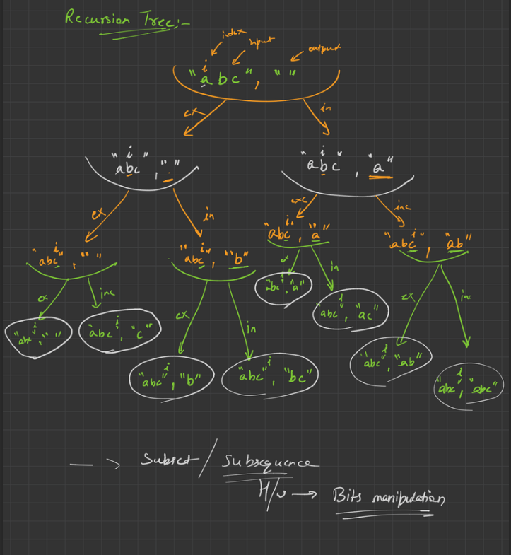

## DRY RUN/APPROACH

## CODE
```cpp
#include <iostream>
#include <string>
#include <vector>

using namespace std;

void subsequents(string str, vector<string> &arr)
{
    if (str.length() == 0)
    {
        arr.push_back("");
        return;
    }
    subsequents(str.substr(1), arr);
    int n = arr.size();
    for (int i = 0; i < n; i++)
    {
        arr.push_back(str[0] + arr[i]);
    }
}

int main()
{
    string str = "abc";
    vector<string> arr;
    subsequents(str, arr);
    for (int i = 0; i < arr.size(); i++)
    {
        cout << arr[i] << " ";
    }
    return 0;
}
```
## EXPLAINATION
This code generates all possible subsequences of a given string using recursion.
* The function subsequents takes two arguments: a string str and a vector of strings arr . It first checks if the length of the string is zero. If it is, it adds an empty string to the vector and returns. Otherwise, it calls itself recursively with the substring of str starting from the second character and the same vector arr.

* After the recursive call, it gets the size of the vector arr and loops through it. For each element in the vector, it concatenates the first character of the original string str with the element and adds the resulting string to the vector.

* The main function initializes a string str and an empty vector arr, and then calls the subsequents function with these arguments. Finally, it loops through the vector arr and prints out each element.